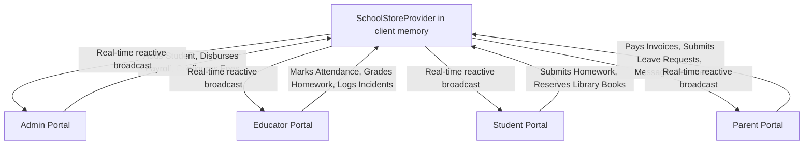

# 00 - Architecture Overview & Component Library Integration

## 1. Executive Summary

This specification defines the architectural foundations, client-side execution strategy, design system tokens, and viewport adaptation rules for the **Frontend-Only Multi-Role Mobile/Tablet School Management Application**.

The application operates without an active backend server, using a client-side reactive state engine (`SchoolStoreProvider` backed by React Context and `localStorage` caching) and visual primitives from `@fahadbillah/component-library`.

---

## 2. Component Library Integration Mapping

The interface is built strictly around the primitives provided by `@fahadbillah/component-library`:

| Component Library Primitive | Operational Role | Mobile Viewport (<600px) | Tablet Viewport (600px–1024px) |
| :--- | :--- | :--- | :--- |
| `AppShell` / Layout | Root structural frame and header/navigation host | 1-column layout, sticky mobile top bar, fixed bottom navigation bar | 2-column layout with fixed vertical side navigation panel |
| `BottomNavigation` | Role-specific primary navigation | Fixed bottom bar displaying 4–5 core actions with badge badges | Suppressed; superseded by side navigation |
| `StatCard` | Key Performance Indicators and metric highlights | Full-width single column vertical stack | 2-column or 4-column responsive grid |
| `Table` (`TableHeader`, `TableRow`, `TableCell`) | Tabular data inspection and record lists | Horizontal touch-scroll table with sticky column headers | Full-width structured data grid with action menus |
| `Modal` / `ModalSheet` | Action sheets, forms, receipt previews, detail modals | Bottom-sheet modal occupying up to 90vh with pull indicator | Centered dialog window with backdrop blur and max-width 640px |
| `Tabs` / Tab navigation | In-page view categorization and status filtering | Horizontally scrollable touch pills | Inline tabs with animated indicators |
| `Badge` | Entity status tags (Paid, Absent, Honor Roll, Delayed) | Compact chip with status color | Full pill tag with icon and text |
| `Input`, `Select`, `Dropdown` | Form handling, data entry, search filters | Full-width stacked inputs with large touch targets (44px min) | Multi-column grid inputs with inline labels |
| `Button` | Primary, secondary, outline, and ghost touch actions | Full-width primary buttons, tactile active states | Inline action buttons with standard icon alignment |
| `Avatar` | Student, educator, and parent profile identification | 32px - 40px circular avatar with fallback initials | 40px - 48px circular avatar with role border |

---

## 3. Viewport Adaptation Architecture

### 3.1 Mobile Viewport (<600px)
- **Top Bar**: Shows brand crest, role badge, user avatar, and notification trigger.
- **Content Area**: Single-column vertical scroll flow with `padding: 16px` and responsive card stacks.
- **Bottom Navigation**: Persistent thumb-friendly bottom bar with 4 to 5 icons mapped to current user role.
- **Touch Targets**: All interactive elements satisfy minimum 44px tap area.

### 3.2 Tablet Viewport (600px - 1024px)
- **Master-Detail Layout**: Persistent 260px vertical sidebar on left displaying institution branding, current persona badge, navigation items with count indicators, and a quick-switch demo tray.
- **Top Action Bar**: Contextual page title, active filter pills, search input, and profile settings menu.
- **Main View**: Multi-column responsive grid (2-column on mini tablets, 3 to 4-column on full tablets).

---

## 4. Client-Side Reactive State Engine

The state architecture is designed to simulate a live database with cross-role reactivity:

### State Store Capabilities:
1. **Initial Seed**: Pre-populated datasets for Students, Faculty, Classes, Invoices, Attendance, Assignments, Buses, Messages, Incidents, and Books.
2. **Persistence**: Synchronizes state snapshots to browser `localStorage` under `MERIT_ACADEMY_STORE_V1` with an instant "Reset Demo Data" option.
3. **Cross-Role Reactivity**: When an Educator updates attendance, the Parent's feed updates immediately. When a Parent pays an invoice, the Admin ledger and collection rate update immediately.
