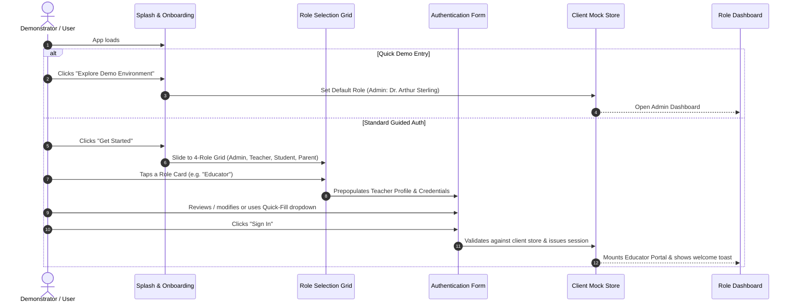

# 01 - Authentication & Multi-Persona Session Management

## 1. Feature Identification
- **Feature Code**: `FEAT-AUTH-00`
- **Feature Title**: Multi-Role Client-Side Authentication, Onboarding & Demo Persona Switching
- **Target Roles**: Global / Unauthenticated / Admin / Educator / Student / Parent

---

## 2. User Story & Flow Overview

### User Story:
> As a client demonstrator or end user, I want to explore the school management app across all four roles (Administrator, Educator, Student, Parent) with zero backend setup, quick-fill credentials, and seamless role switching so that I can experience role-tailored flows and verify cross-role data reactivity.

### Step-by-Step UI Flow:

---

## 3. UI Component Assembly & Layout

### 3.1 Splash Screen
- **Component Assembly**: `Card`, `Button`, `Badge`, `Avatar`.
- **Layout**: Centered hero card with institution emblem (`🏫`), academy title, tagline, 3 feature summary pills (Administrative Tower, Educator Workspace, Student & Parent Portals), primary CTA "Get Started", and secondary "Explore Demo Environment".

### 3.2 Role Selector Screen
- **Component Assembly**: `Card`, `Badge`, `Button`.
- **Layout**: 2x2 grid of interactive role cards:
  1. **Administrator**: Crest icon (`🏛️`), badge "Institutional Control", summary: class setups, payroll & finance.
  2. **Educator / Teacher**: Quill icon (`👩‍🏫`), badge "Classroom Ops", summary: rapid attendance & gradebook.
  3. **Student**: Backpack icon (`🎒`), badge "Learning Hub", summary: coursework locker & schedules.
  4. **Parent / Guardian**: Family icon (`👨‍👩‍👧`), badge "Ward Tracking", summary: bus transit & fee payments.

### 3.3 Authentication Form Screen
- **Component Assembly**: `Input`, `Dropdown`, `Button`, `Badge`.
- **Fields**:
  - `Institution Code`: Pre-filled (`MERIT-2026`)
  - `Persona Quick-Fill`: Dropdown to swap instant persona profiles:
    - Dr. Arthur Sterling (Super Administrator)
    - Prof. Eleanor Vance (Lead Faculty - STEM)
    - Lucas Montgomery (Grade 8A Honor Student)
    - Katherine Montgomery (Parent & PTA Committee)
  - `User ID / Email`: Editable input
  - `Password`: Masked input (`••••••••••••`)
  - `Sign In Button`: Displays spinner upon submit and simulates authentication latency (~600ms).

---

## 4. Persona Quick-Switching (In-Session)
When authenticated, the persistent navigation shell provides instant persona switching:
- **Tablet / Desktop**: Persistent sidebar footer with 4 micro-pill buttons (`Admin`, `Teacher`, `Student`, `Parent`).
- **Mobile Top Bar**: Role indicator chip that opens a quick role modal or dropdown.
- **State Transition**: Role change preserves current client state (modifications, marked attendance, created assignments) while instantaneously shifting navigation and dashboard views.
