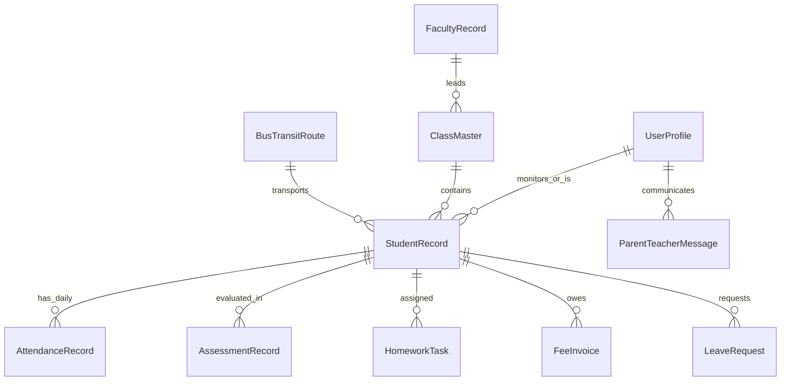

# 06 - Cross-Role Reactive State & Data Sync

## 1. Overview & Data Schema

The school management application simulates a multi-tier client-server relational database in browser memory. Every mutation executed in any role updates the centralized store (`SchoolStoreProvider`), immediately reflecting across other roles when switching personas or viewing linked feeds.

---

## 2. Relational Entity Schemas

---

## 3. Cross-Role Reactivity Matrix

| User Action | Triggering Role | Immediate Downstream State Changes | Impacted Views Across Roles |
| :--- | :--- | :--- | :--- |
| **Mark Attendance** | **Educator** | `students[id].attendanceStatus` updated; `AttendanceRecord` logged. | - **Parent**: Today's attendance badge changes from `Present` to `Absent/Late`. - **Admin**: Dashboard Attendance Rate KPI recalculates. - **Student**: Attendance streak percentage updates. |
| **Publish Assessment / Grade** | **Educator** | `homework[id].status = 'graded'`; `score` & `feedback` set; `AssessmentRecord` recorded. | - **Student**: Homework moves to "Graded" tab with score & teacher note. - **Parent**: Ward academic score feed updates with new marks. - **Admin**: Class average GPA updates. |
| **Submit Homework** | **Student** | `homework[id].status = 'submitted'`; submission file attached. | - **Educator**: Homework appears in teacher's "Needs Review" grading queue. - **Parent**: Homework item shows "Submitted on Time" badge. |
| **Pay Fee Invoice** | **Parent** | `fees[id].status = 'paid'`; `receiptNo` generated; `paidDate` recorded. | - **Admin**: Total collected revenue increases, pending revenue decreases, collection % jumps. - **Parent**: Invoice card switches to "Paid" with downloadable receipt button. |
| **Submit Leave Slip** | **Parent** | `leaveRequests` prepended with `status = 'pending'`. | - **Educator**: Leave request appears on Teacher's Leave Adjudication panel. - **Admin**: Daily expected absences list increments. |
| **Approve Leave Request** | **Educator** | `leaveRequests[id].status = 'approved'`. | - **Parent**: Leave slip status changes from "Pending" to "Approved" with green badge. |
| **Issue Circular / Notice** | **Admin** | `notifications` appended with priority tag and audience roles. | - **Student**: New circular appears on Student Activity Feed. - **Educator**: Announcement appears on Teacher Workspace. - **Parent**: Circular appears on Parent Ward Overview. |
| **New Student Admission** | **Admin** | `students` appended; default tuition `FeeInvoice` generated; class enrolled count +1. | - **Educator**: New student automatically appears in teacher's attendance roster and gradebook. - **Admin**: Total Enrolled Students KPI increments. |

---

## 4. Reset & Persistence Mechanics
- **Local Storage Synchronization**:
  - The store persists state snapshots into browser `localStorage` on every mutation.
  - Page refresh preserves all in-progress changes, simulated payments, homework uploads, and attendance records.
- **Demo Reset Button**:
  - Located on the sidebar footer and layout header.
  - Instantly clears `localStorage` and restores the pristine default seed datasets (`INITIAL_STUDENTS`, `INITIAL_FACULTY`, `INITIAL_CLASSES`, etc.) with a single tap.
